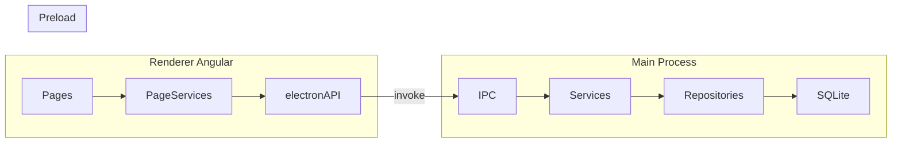

# Clarix — Project Plan

> Living document reflecting the codebase state on `dev`. Update this file as phases complete.

## 1. Vision and Scope

### Target users

### In scope (v1)

### Out of scope (deferred)

## 2. Architecture Reference

### Tech stack

| Layer                  | Technology                                                             |
| ---------------------- | ---------------------------------------------------------------------- |
| Desktop shell          | Electron 40                                                            |
| Frontend               | Angular 21 (standalone components), Spartan-ng, Tailwind CSS 4         |
| State                  | `@ngneat/elf` + `elf-persist-state` (form DTOs, auth flag)             |
| Tables / forms         | `@tanstack/angular-table`, custom `datatable-builder` / `form-builder` |
| Backend (main process) | TypeORM 0.3, `better-sqlite3`, `class-validator`, bcrypt               |
| IPC                    | `contextBridge` preload → `ipcMain.handle`                             |
| Tests                  | Vitest                                                                 |

### Process flow



### Layer responsibilities

| Path                    | Role                                                                 |
| ----------------------- | -------------------------------------------------------------------- |
| `src/`                  | Angular renderer — pages, components, stores, guards                 |
| `src-electron/`         | Electron main process — database, IPC handlers, business logic       |
| `src-electron/modules/` | Domain modules ()                                                    |
| `src-electron/shared/`  | Cross-cutting concerns (database, storage, user-management scaffold) |
| `libs/ui/`              | Spartan Helm UI primitives (sidebar, dialog, sheet, etc.)            |

### Backend module pattern

Each domain follows the same structure:

```
modules/<domain>/
  entities/
  repositories/
  services/
  dtos/
  ipcs/
```

Services extend `AbstractCrudService`; repositories extend `DatabaseAbstractRepository`. Entities extend `EntityHelper` (adds `createdAt`, `updatedAt`, `deletedAt`, soft-delete support).

### Frontend patterns

- **Pages** in `src/pages/` — one feature per folder with a local `*.service.ts` wrapping `window.electronAPI`
- **IPC access** — RxJS `from(window.electronAPI!.<domain>.<action>(...))`
- **State** — Elf stores for sheet form DTOs (`createDto` / `updateDto`) and auth persistence; page data often uses `BehaviorSubject`
- **Auth** — `authGuard` checks persisted `authenticated` flag from `AuthPersistRepository`
- **Layout** — sidebar + breadcrumbs; hidden on `/login`

### Development commands

See [README.md](../README.md):

```bash
npm run electron:dev   # Angular dev server + Electron with hot-reload
npm test               # Vitest unit tests
npm run build          # Production Angular build
npm run electron       # Build Electron + Angular, run packaged locally
```

Database file location: `{userData}/clarix.db` (Electron app data directory).

---

## 3. Current Feature Matrix

### Routed pages

### Sidebar nav placeholders (no route)

### Backend-only / not wired to UI

## 4. Known Bugs and Tech Debt

    |

## 5. Phased Roadmap

## 6. Data Model Overview

### Entity relationships

### Enums

---

## 7. IPC Channel Registry

### Registered in `main.ts`

### Exposed in preload (subset)

The renderer can only call handlers listed in `src-electron/preload.ts`. Storage handlers **not** exposed to renderer: `findAll`, `findBySlug`, `loadResource`, `duplicate`, `expose`, `hide`, `confirm`, `unconfirm`, `findTemporary`.

### IPC naming convention

```
<domain>:<action>
```

---

## 8. Testing Strategy

### Current state

### Target coverage

### Critical path to test

## 9. Open Questions / Decisions Needed

---

## Appendix: Key Entry Points

| File                                       | Purpose                                               |
| ------------------------------------------ | ----------------------------------------------------- |
| `src-electron/main.ts`                     | Electron bootstrap, IPC registration, window creation |
| `src-electron/preload.ts`                  | Secure IPC bridge (`window.electronAPI`)              |
| `src-electron/shared/database/database.ts` | SQLite initialization, entity registration            |
| `src/app/app.routes.ts`                    | Angular route definitions                             |
| `src/components/layout/data.ts`            | Sidebar navigation config                             |
| `src/types/electron.d.ts`                  | TypeScript types for preload API                      |
| `src/guards/auth.guard.ts`                 | Route authentication guard                            |
